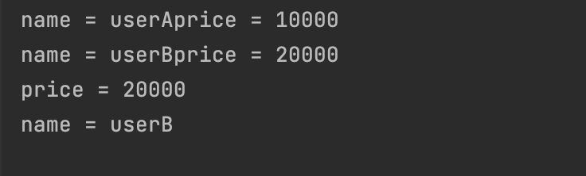
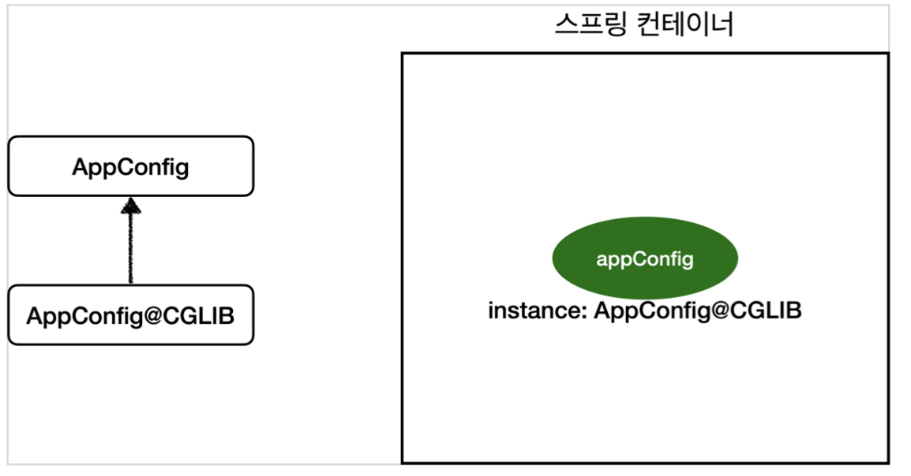
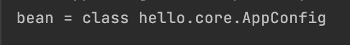

인프런 **[스프링 핵심 원리 - 기본편](https://www.inflearn.com/course/스프링-핵심-원리-기본편/dashboard)** 강의를 듣고 정리한 포스팅입니다.
{: .notice--info}


# 싱글톤 패턴이란?

클래스의 인스턴스가 **딱 1개만 생성되는 것**을 보장하는 디자인 패턴이다.

앱 어플리케이션에서는 보통 여러 고객이 동시에 요청을 하는데 그떄마다 클래스의 인스턴스를 생성하면 비효율적이다. ex) 100개의 요청에 100개의 인스턴스가 생성되고 소멸된다.

효율적으로 인스턴스를 사용하고자 스프링에서 빈(Bean)을 보통 싱글톤 패턴으로 관리한다.

### 싱글톤 패턴의 문제점

- 싱글톤 패턴을 구현하는 코드 자체가 많이 들어간다.
- 의존관계상 클라이언트가 구체 클래스에 의존한다. DIP를 위반한다.
- 클라이언트가 구체 클래스에 의존해서 OCP 원칙을 위반할 가능성이 높다.
- 테스트하기 어렵다.
- 내부 속성을 변경하거나 초기화 하기 어렵다.
- private 생성자로 자식 클래스를 만들기 어렵다.
- 결론적으로 유연성이 떨어진다.
- 안티패턴으로 불리기도 한다.

## 싱글톤 컨테이너

스프링 컨테이너는 싱글톤 패턴의 문제점을 해결하면서 객체 인스턴스를 싱글톤으로 관리한다.

스프링 컨테이너를 사용하면 싱글톤 패턴으로 빈을 관리하는데 이렇게 싱글톤 객체를 생성하고 관리하는 기능을 **싱글톤 레지스트리**라 한다.

스프링 컨테이너의 기능 덕분에 싱글턴 패턴의 **모든 단점을 해결**하면서 객체를 싱글톤으로 유지할 수 있다.

### 싱글톤 방식의 주의점

객체 인스턴스를 하나만 생성해서 공유하는 싱글톤 방식은 여러 클라이언트가 하나의 같은 객체 인스턴스를 공유하기 때문에 싱글톤 객체의 상태는 항상 **무상태(stateless)**로 설계해야 한다.

**무상태(stateless)**

- 특정 클라이언트에 의존적인 필드가 있으면 안된다.
- 특정 클라이언트가 값을 변경할 수 있는 필드가 있으면 안된다.
- 가급적 읽기만 가능해야 한다.
- 필드 대신에 자바에서 공유되지 않는, 지역변수, 파라미타, ThreadLocal 등을 사용해야 한다.

### 상태 유지할 경우 발생되는 문제점 예시

```java
public class StatefulService {
  private int price; // 상태를 유지하는 필드
  private String name; // 상태를 유지하는 필드

  public void order (String name, int price) {
    System.out.println("name = " + name + "price = " + price);
    this.price = price;
    this.name = name;
  }

  public int getPrice() {return price;}
  public String getName() {return name;}
}
```

```java
class StatefulServiceTest {
  @Test
  void statefullServiceSingleton() {
    ApplicationContext ac = new AnnotationConfigApplicationContext(TestConfig.class);
    StatefulService statefullService1 = ac.getBean("statefullService", StatefulService.class);
    StatefulService statefullService2 = ac.getBean("statefullService", StatefulService.class);

    // ThreadA: A사용자가 10000원 주문
    statefullService1.order("userA",10000);
    // ThreadA: B사용자가 20000원 주문
    statefullService2.order("userB",20000);

    //ThreadA : 사용자A 주문 금액 조회
    int price = statefullService1.getPrice();
    String name = statefullService1.getName();
    // 20000원이 나옴 error
    System.out.println("price = " + price);
    System.out.println("name = " + name);
    assertThat(statefullService1.getPrice()).isEqualTo(20000);
  }

  static class TestConfig {
    @Bean
    public StatefulService statefullService() {
      return new StatefulService();
    }
  }
}
```

**결과**

<p align = "center"></p>

`statefullService1` 의 name, price = userA, 10000 으로 설정하였지만 userB와 인스턴스를 공유하여  userB, 20000이 되었다.

싱글톤 패턴을 사용할 때 공유되는 필드가 없게 무상태로 설계해야 한다!!

## 스프링에서 싱글톤 패턴 적용하기

싱글톤 컨테이너(싱글톤 레지스트리)를 사용하려면 `@Configuration` 어노테이션을 적용해주면 된다.

```java
// AppConfig.java
@Configuration
public class AppConfig {

  @Bean
  public MemberRepository memberRepository() {
    System.out.println("call AppConfig.memberRepository");
    return new MemoryMemberRepository();
  }
...
```

`@Configuration` 어노테이션을 사용하면 밑의 결과와 같이 클래스 명 뒤에 CGLIB … 가 붙으면서 복잡해진다. 

스프링에서 싱글톤 패턴을 사용하기 위해 CGLIB라는 바이트코드 조작 라이브러리를 사용해서 클래스를 상속받은 임의의 다른 클래스를 만들고, 다른 클래스를 스프링 빈으로 등록한 것이다.

<p align = "center"></p>

<p align = "center"></p>

그 다른 클래스가 싱글톤이 보장되도록 해준다!

만약 @Configuration 을 적용하지 않는다면  밑의 결과처럼 CGLIB 라이브러리를 사용하지 않는다. 

**즉 싱글톤 패턴이 보장되지 않는다!**

<p align = "center"></p>