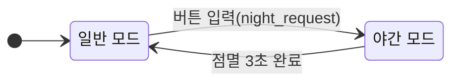
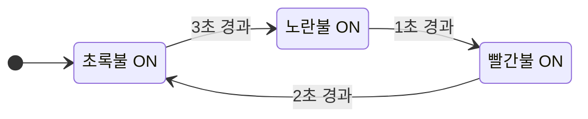

# 신호등 구현
지금까지 공부했던 polling과 intercept 를 이용한 GPIO 제어를 연습하기 위해 신호등을 구현해보았다.  

## 구현 기능
1. 기본 모드(MODE_DAY)
- 신호등은 다음 순서로 무한 반복 동작한다.
  - GREEN: 3초
  - YELLOW: 1초
  - RED: 2초

2. 야간 모드(MODE_NIGHT)
  - 사용자가 버튼을 누르면 야간 모드로 전환된다.
  - 야간 모드에서는 YELLOW LED가 1초 주기로 3회 점멸한다.
  - 점멸이 완료되면 기본 모드(MODE_DAY)로 복귀한다.


### 상위 상태 전이도
시스템의 동작 모드를 관리하는 상위 상태 전이도이다.  



```c
typedef enum {
    MODE_DAY = 0,
    MODE_NIGHT
} traffic_mode_t;
```

### 하위 상태 전이도
기본 모드(MODE_DAY) 내부에서 신호등 색상 전환을 관리하는 하위 상태 전이도이다.  



```c
typedef enum {
    DAY_GREEN = 0,
    DAY_YELLOW,
    DAY_RED
} day_state_t;
```

### 타이머 설계
신호등 구현에서는 `HAL_Delay()` 대신 TIM2 주기 인터럽트 + 소프트웨어 타이머 방식으로 시간을 관리했다. 이를 위해 `00_timer2.c`에서 다음과 같은 구조를 사용했다.

```c
// 00_timer2.c
volatile uint32_t tim2_tick_ms = 0;

void HAL_TIM_PeriodElapsedCallback(TIM_HandleTypeDef *htim)
{
    if (htim->Instance == TIM2)
    {
        tim2_tick_ms++;

        for (size_t i = 0; i < tim2_cb_count; ++i) {
            tim2_callbacks[i]();
        }
    }
}

uint32_t get_tim2_ms(void)
{
    return tim2_tick_ms;
}

```
TIM2를 주기 인터럽트 타이머로 설정하고, 인터럽트가 발생할 때마다 `tim2_tick_ms`를 1씩 증가시킨다.(1ms)  
`07_traffic_light.c`에서는 `get_tim2_ms()`로 현재 시간을 읽고, `now - state_start_ms >= 3000` 처럼 시간 차이로 상태 전환을 판단한다.  
이 방식의 장점은, `HAL_Delay()`처럼 CPU를 멈추지 않고도 버튼 입력, 상태 머신, LED 제어를 동시에 처리할 수 있다는 점이다.

```c
// 07_traffic_light.c
...
case DAY_GREEN:
  if (now - state_start_ms >= 3000)
  {
      day_state = DAY_YELLOW;
      state_start_ms = now;
      set_leds(0, 1, 0);
  }
  break;
...
```

### LED 제어 로직 캠슐화
세 개의 신호등 LED 상태를 한 번에 갱신하기 위해 set_leds(green, yellow, red)라는 공통 함수를 두었다.  
각 상태 코드에서는 이 함수에 어떤 색을 켤지만 넘기고, 실제 GPIO 제어(HAL_GPIO_WritePin)와 핀 번호는 함수 내부에 숨겨서 관리한다.  
덕분에 LED 핀 변경이나 제어 방식을 수정할 때 한 곳만 고치면 되고, 상태머신 코드는 신호 의미(초록/노랑/빨강)에만 집중할 수 있어 읽기와 유지보수가 더 쉬워진다.

```c
// 07_traffic_light.c
static void set_leds(uint8_t green, uint8_t yellow, uint8_t red)
{
  HAL_GPIO_WritePin(LED_PORT, GREEN_LED_PIN, green ? GPIO_PIN_SET : GPIO_PIN_RESET);
  HAL_GPIO_WritePin(LED_PORT, YELLOW_LED_PIN, yellow ? GPIO_PIN_SET : GPIO_PIN_RESET);
  HAL_GPIO_WritePin(LED_PORT, RED_LED_PIN, red ? GPIO_PIN_SET : GPIO_PIN_RESET);
}
```

### 디바운스 방지 로직
사용자가 버튼을 눌렀을 때 기계적 접점이 붙거나 떨어질 때 아주 짧은 시간 동안 신호가 요동치는데 이걸 채터링 또는 디바운스라고 한다.  
이를 잡기위해 마지막으로 버튼이 눌린 시점을 기록해두고, 0.2초 이내에 다시 들어오는 신호는 무시처리했다.

```c
// 07_traffic_light.c
void HAL_GPIO_EXTI_Callback(uint16_t GPIO_Pin)
{
  static uint32_t last_exti_ms = 0;
  uint32_t now = get_tim2_ms();

  if (GPIO_Pin == B1_Pin)
  {
    // 마지막 인터럽트 발생 후 200ms가 지났을 때만 유효한 입력으로 처리
    if (now - last_exti_ms > 200)
    {
      night_request = true;
      last_exti_ms = now;
    }
  }
}
```

## 전체 코드
```c
// 07_traffic_light.c
#include <stdint.h>
#include <stdbool.h>
#include "07_traffic_light.h"
#include "00_timer2.h"
#include "main.h"

typedef enum {
    MODE_DAY = 0,
    MODE_NIGHT
} traffic_mode_t;

typedef enum {
    DAY_GREEN = 0,
    DAY_YELLOW,
    DAY_RED
} day_state_t;


static traffic_mode_t mode = MODE_DAY;
static day_state_t day_state = DAY_GREEN;

static volatile bool night_request = false;

static uint32_t state_start_ms = 0;
static uint32_t last_blink_ms = 0;
static uint8_t blink_count = 0;


static void set_leds(uint8_t green, uint8_t yellow, uint8_t red)
{
    HAL_GPIO_WritePin(LED_PORT, GREEN_LED_PIN,
                      green ? GPIO_PIN_SET : GPIO_PIN_RESET);
    HAL_GPIO_WritePin(LED_PORT, YELLOW_LED_PIN,
                      yellow ? GPIO_PIN_SET : GPIO_PIN_RESET);
    HAL_GPIO_WritePin(LED_PORT, RED_LED_PIN,
                      red ? GPIO_PIN_SET : GPIO_PIN_RESET);
}

static void day_fsm_run(uint32_t now)
{
    switch (day_state)
    {
    case DAY_GREEN:
        if (now - state_start_ms >= 3000)
        {
            day_state = DAY_YELLOW;
            state_start_ms = now;
            set_leds(0, 1, 0);
        }
        break;

    case DAY_YELLOW:
        if (now - state_start_ms >= 1000)
        {
            day_state = DAY_RED;
            state_start_ms = now;
            set_leds(0, 0, 1);
        }
        break;

    case DAY_RED:
        if (now - state_start_ms >= 2000)
        {
            day_state = DAY_GREEN;
            state_start_ms = now;
            set_leds(1, 0, 0);
        }
        break;
    }
}

static void night_fsm_run(uint32_t now)
{
    if (now - last_blink_ms >= 1000)
    {
        last_blink_ms = now;
        HAL_GPIO_TogglePin(LED_PORT, YELLOW_LED_PIN);
        blink_count++;
    }

    if (blink_count >= 6)
    {
        mode = MODE_DAY;
        day_state = DAY_GREEN;
        state_start_ms = now;
        set_leds(1, 0, 0);
    }
}

void traffic_light_run(void)
{
    uint32_t now;

    set_leds(1, 0, 0);
    state_start_ms = get_tim2_ms();

    while (1)
    {
        now = get_tim2_ms();

        if (night_request)
        {
            night_request = false;
            mode = MODE_NIGHT;
            blink_count = 0;
            last_blink_ms = now;
            set_leds(0, 1, 0);
        }

        switch (mode)
        {
        case MODE_DAY:
            day_fsm_run(now);
            break;

        case MODE_NIGHT:
            night_fsm_run(now);
            break;
        }
    }
}

void HAL_GPIO_EXTI_Callback(uint16_t GPIO_Pin)
{
    static uint32_t last_exti_ms = 0;
    uint32_t now = get_tim2_ms();

    if (GPIO_Pin == B1_Pin)
    {
        if (now - last_exti_ms > 200) // 디바운스
        {
            night_request = true;
            last_exti_ms = now;
        }
    }
}
```

## 마무리
지금까지 배웠던 인터럽트, 폴링, GPIO 제어를 모두 활용해서 신호등 모드를 구현해 보았다. 간단한 예제지만, 모드를 enum으로 분리하고 상태머신 형태로 정리하면서 “임베디드에서 로직을 구조적으로 짜는 법”을 한 번 맛볼 수 있었다. 특히 버튼은 인터럽트로, 신호 전환은 타이머 기반 폴링으로 나누어 처리해 보니, 이전에 사용하던 Java 상태머신과도 비슷한 점이 있어 더 재미있게 느껴졌다. 다음에는 이번 패턴을 그대로 확장해서 7세그먼트나 모터를 붙인 RC 카 프로젝트로 이어가 볼 예정이다.