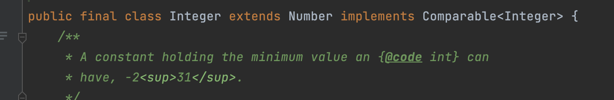
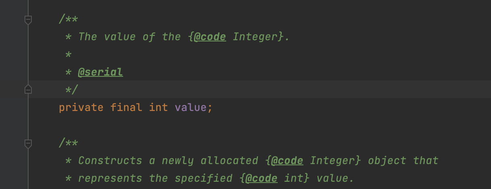

# 0515(월) 오늘 한일

자바 primitive type, reference type에 대해 찾아봤다.

- 원시 타입과 참조 타입의 차이점은 null값을 가질 수 있는지, 없는지에 대해서만 알고있었는데 찾아보면서 어제 공부했던 JVM 메모리와 관련되어 있는 것을 알았다.
- 원시 타입은 null값을 가질 수 없고, JVM의 Stack영역에 저장된다.
- 참조 타입은 null값을 가질 수 있고, JVM의 Heep영역에 저장된다.
- 인터넷에서 찾아보면서 yaboong님의 블로그를 보고 많은 도움을 받았다. 한줄씩 코드를 해석하면서 그림과 같이 설명해 주는데 이해가 너무 잘됐다. [링크](https://yaboong.github.io/java/2018/05/26/java-memory-management/)

yaboong님의 블로그를 보다가 불변객체에 대해 나와서 정리했다.

- 불변 객체(immutable)는 한 번 생성되면 내부 상태가 변경되지 않는 객체이다.
- 자바에서는 String, Wrapper 클래스, 큰 정수나 실수를 표현하는 BigInteger, BigDecimal가 있다.
- 블로그에서 Integer클래스가 왜 불변인지 자바 내부를 보는 내용이 있어 직접 찾아보았다.
- Integer클래스에 final 키워드가 붙어있는 걸 볼 수 있는데, class에 final 키워드는 “상속불가능”이라는 의미이며

- Integer클래스에서 사용하는 값인 `value` 에 final 키워드가 붙어있어 불변 객체를 의미한다.

래퍼 클래스와 관련된 오토박싱 기능에 대해서도 정리했다. [Integer.valueOf() 파해치기!](https://hstla.github.io/java/Integer_valueOf/) 

어제 공부한 JVM 메모리 영역이 원시 타입과 참조 타입를 공부할 때 바로 나와서 신기했고 JVM에 대해 정리한게 앞으로 자바를 공부할 때 많은 도움이 될 것같다.

java에 대해 공부할 때 chatGPT에게 많이 물어봤는데 많은 도움이 됐다. 무료버전이라서 정확도가 낮을 것같아 더블 체크를 꼭하는데 코드나 동작에 있어서는 정확도가 높은 것같다. 또 답변에 모르는 개념이 있으면 다시 질문하는 식으로 꼬리물기처럼 깊게 공부할 수 있어 좋았다.

---

# 0516(화) 오늘 한일

내일 면접을 위해 자기소개서에 작성한 경험을 바탕으로 질문지를 만들어 연습을 했다. 

혹시 몰라 네트워크나 자바관련 기초적인 지식도 짧게 정리하고 키워드 위주로 답변하려 연습했다. 오랜만에 면접이라 너무 떨린다

---

