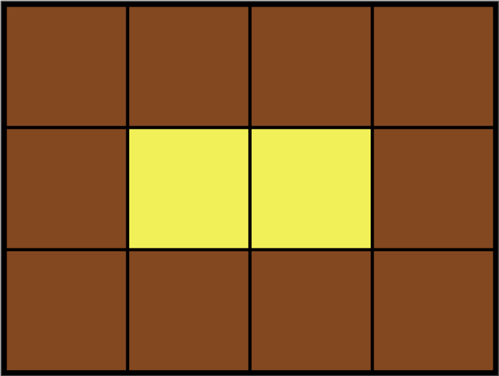

## 짝지어 제거하기(12973)

### **문제 설명**

짝지어 제거하기는, 알파벳 소문자로 이루어진 문자열을 가지고 시작합니다. 먼저 문자열에서 같은 알파벳이 2개 붙어 있는 짝을 찾습니다. 그다음, 그 둘을 제거한 뒤, 앞뒤로 문자열을 이어 붙입니다. 이 과정을 반복해서 문자열을 모두 제거한다면 짝지어 제거하기가 종료됩니다. 문자열 S가 주어졌을 때, 짝지어 제거하기를 성공적으로 수행할 수 있는지 반환하는 함수를 완성해 주세요. 성공적으로 수행할 수 있으면 1을, 아닐 경우 0을 리턴해주면 됩니다.

예를 들어, 문자열 S = `baabaa` 라면

b *aa* baa → *bb* aa → *aa* →

의 순서로 문자열을 모두 제거할 수 있으므로 1을 반환합니다.

### 제한사항

- 문자열의 길이 : 1,000,000이하의 자연수
- 문자열은 모두 소문자로 이루어져 있습니다.

---

### 입출력 예

| s | result |
| --- | --- |
| baabaa | 1 |
| cdcd | 0 |

### 풀이

스택을 사용하여 풀었다. `stack.peek()` 를 사용하여 전에 문자를 꺼내 이번 문자와 같으면 `pop()` 아니면 `push()` 사용했고 stack이 비어있음녀 1을 출력하도록 했다.

### 정답코드

```java
public int solution(String s) {
    Stack<Character> stack = new Stack<>();
    for (char c : s.toCharArray()) {
        if (!stack.isEmpty() && stack.peek() == c) {
            stack.pop();
        } else {
            stack.push(c);
        }
    }
    return stack.isEmpty() ? 1 : 0;
}
```

## 2. 영어 끝말잇기(12981)

### **문제 설명**

1부터 n까지 번호가 붙어있는 n명의 사람이 영어 끝말잇기를 하고 있습니다. 영어 끝말잇기는 다음과 같은 규칙으로 진행됩니다.

1. 1번부터 번호 순서대로 한 사람씩 차례대로 단어를 말합니다.
2. 마지막 사람이 단어를 말한 다음에는 다시 1번부터 시작합니다.
3. 앞사람이 말한 단어의 마지막 문자로 시작하는 단어를 말해야 합니다.
4. 이전에 등장했던 단어는 사용할 수 없습니다.
5. 한 글자인 단어는 인정되지 않습니다.

다음은 3명이 끝말잇기를 하는 상황을 나타냅니다.

tank → kick → know → wheel → land → dream → mother → robot → tank

위 끝말잇기는 다음과 같이 진행됩니다.

- 1번 사람이 자신의 첫 번째 차례에 tank를 말합니다.
- 2번 사람이 자신의 첫 번째 차례에 kick을 말합니다.
- 3번 사람이 자신의 첫 번째 차례에 know를 말합니다.
- 1번 사람이 자신의 두 번째 차례에 wheel을 말합니다.
- (계속 진행)

끝말잇기를 계속 진행해 나가다 보면, 3번 사람이 자신의 세 번째 차례에 말한 tank 라는 단어는 이전에 등장했던 단어이므로 탈락하게 됩니다.

사람의 수 n과 사람들이 순서대로 말한 단어 words 가 매개변수로 주어질 때, 가장 먼저 탈락하는 사람의 번호와 그 사람이 자신의 몇 번째 차례에 탈락하는지를 구해서 return 하도록 solution 함수를 완성해주세요.

### 제한 사항

- 끝말잇기에 참여하는 사람의 수 n은 2 이상 10 이하의 자연수입니다.
- words는 끝말잇기에 사용한 단어들이 순서대로 들어있는 배열이며, 길이는 n 이상 100 이하입니다.
- 단어의 길이는 2 이상 50 이하입니다.
- 모든 단어는 알파벳 소문자로만 이루어져 있습니다.
- 끝말잇기에 사용되는 단어의 뜻(의미)은 신경 쓰지 않으셔도 됩니다.
- 정답은 [ 번호, 차례 ] 형태로 return 해주세요.
- 만약 주어진 단어들로 탈락자가 생기지 않는다면, [0, 0]을 return 해주세요.

---

### 입출력 예

| n | words | result |
| --- | --- | --- |
| 3 | ["tank", "kick", "know", "wheel", "land", "dream", "mother", "robot", "tank"] | [3,3] |
| 5 | ["hello", "observe", "effect", "take", "either", "recognize", "encourage", "ensure", "establish", "hang", "gather", "refer", "reference", "estimate", "executive"] | [0,0] |
| 2 | ["hello", "one", "even", "never", "now", "world", "draw"] | [1,3] |

### 풀이

구현문제이다.  끝말잇기 중복을 없애기위해 Set를 사용했고, 복잡한 코드를 `checkC` 메소드로 만들어서 간단하게 만들었다. 몇번째 단어가 틀렸는지 쉽게 구현할 수 있었지만 번호와 차례를 구할 때가 더 어려웠다. 3개의 예제를 모두 대입해가면서 간신히 풀었다.

### 내 코드

```java
public static Set<String> set = new HashSet<>();

public static boolean checkC(String s1, String s2) {
    if (s1.charAt(s1.length() - 1) == s2.charAt(0)) return true;
    else return false;
}

static public int[] solution(int n, String[] words) {
    int[] answer = new int[2];
    int tmp = 0;
    for (int i = 1; i < words.length; i++) {
        set.add(words[i - 1]);
        if (!checkC(words[i - 1], words[i]) || set.contains(words[i])) {
            tmp = i;
            break;
        }
    }
    if (tmp == 0) {
        answer[0] = 0;
        answer[1] = 0;
        return answer;
    } else {
        answer[0] = (tmp % n) + 1;
        answer[1] = (tmp / n) + 1;
    }
    return answer;
}
```

## 3. 카펫(42842)

### **문제 설명**

Leo는 카펫을 사러 갔다가 아래 그림과 같이 중앙에는 노란색으로 칠해져 있고 테두리 1줄은 갈색으로 칠해져 있는 격자 모양 카펫을 봤습니다.

<p align = "center"></p>

Leo는 집으로 돌아와서 아까 본 카펫의 노란색과 갈색으로 색칠된 격자의 개수는 기억했지만, 전체 카펫의 크기는 기억하지 못했습니다.

Leo가 본 카펫에서 갈색 격자의 수 brown, 노란색 격자의 수 yellow가 매개변수로 주어질 때 카펫의 가로, 세로 크기를 순서대로 배열에 담아 return 하도록 solution 함수를 작성해주세요.

### 제한사항

- 갈색 격자의 수 brown은 8 이상 5,000 이하인 자연수입니다.
- 노란색 격자의 수 yellow는 1 이상 2,000,000 이하인 자연수입니다.
- 카펫의 가로 길이는 세로 길이와 같거나, 세로 길이보다 깁니다.

### 입출력 예

| brown | yellow | return |
| --- | --- | --- |
| 10 | 2 | [4, 3] |
| 8 | 1 | [3, 3] |
| 24 | 24 | [8, 6] |

### 풀이

타일의 총 수는 가로 세로의 곱하고 같다는 생각으로 접근하였다. 제한사항에 가로 길이는 세로 ㄱ

### 내 코드

```java
public int[] solution(int brown, int yellow) {
	  int width = 0, length = 0;
	  int add = brown + yellow;
	  boolean a = true;
	  while (a) {
	      width++;
	      for (length = 1; length <= width; length++) {
	          if (width * length == add && yellow == (width - 2) * (length - 2)) {
	              a = false;
	              break;
	          }
	      }
	  }
	  int[] answer = {width, length};
	  return answer;
}
```

## 4. 구명보트(42885)

### **문제 설명**

무인도에 갇힌 사람들을 구명보트를 이용하여 구출하려고 합니다. 구명보트는 작아서 한 번에 최대 **2명**씩 밖에 탈 수 없고, 무게 제한도 있습니다.

예를 들어, 사람들의 몸무게가 [70kg, 50kg, 80kg, 50kg]이고 구명보트의 무게 제한이 100kg이라면 2번째 사람과 4번째 사람은 같이 탈 수 있지만 1번째 사람과 3번째 사람의 무게의 합은 150kg이므로 구명보트의 무게 제한을 초과하여 같이 탈 수 없습니다.

구명보트를 최대한 적게 사용하여 모든 사람을 구출하려고 합니다.

사람들의 몸무게를 담은 배열 people과 구명보트의 무게 제한 limit가 매개변수로 주어질 때, 모든 사람을 구출하기 위해 필요한 구명보트 개수의 최솟값을 return 하도록 solution 함수를 작성해주세요.

### 제한사항

- 무인도에 갇힌 사람은 1명 이상 50,000명 이하입니다.
- 각 사람의 몸무게는 40kg 이상 240kg 이하입니다.
- 구명보트의 무게 제한은 40kg 이상 240kg 이하입니다.
- 구명보트의 무게 제한은 항상 사람들의 몸무게 중 최댓값보다 크게 주어지므로 사람들을 구출할 수 없는 경우는 없습니다.

### 입출력 예

| people | limit | return |
| --- | --- | --- |
| [70, 50, 80, 50] | 100 | 3 |
| [70, 80, 50] | 100 | 3 |

### 풀이

Arrays.sort(people) 로 배열을 정렬한 후 제일 큰 수와 작은 수를 더해서 리미트와 비교한다. 

리미트보다 크면 큰 수의 인덱스를 줄이고, 리미트보다 작으면 작은 수의 인덱스를 증가시킨다.

### 내 코드

```java
public int solution(int[] people, int limit) {
    int answer = 0;
    Arrays.sort(people);
    int i = 0;
    int j = people.length - 1;

    while (i < j) {
        int sum = people[i] + people[j];
        if (sum <= limit) {
            answer++;
            i++;
        } else {
            answer++;
        }
        j--;
    }
    if (i == j) answer++;

    return answer;
}
```

## 배운 점

중복 확인하려면 `Set<>` 자료구조의 `set.contains()` 함수를 사용하면 쉽게 풀 수 있다.