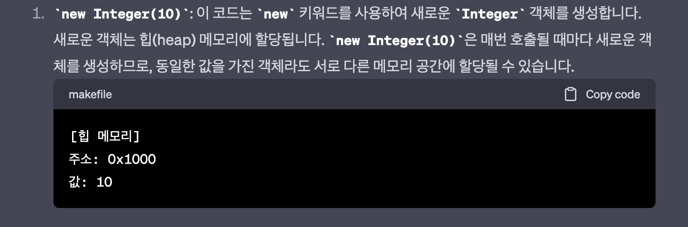
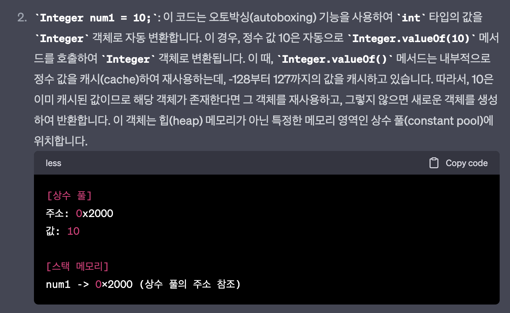
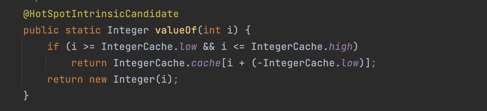
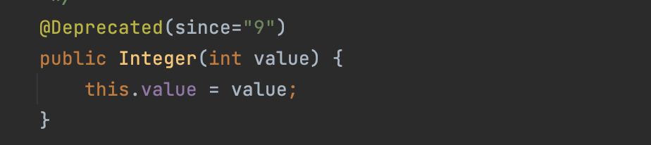
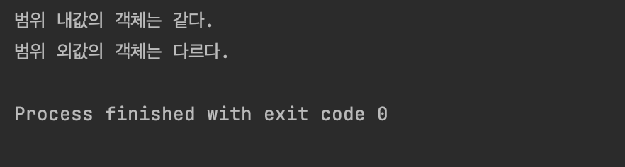

오토 박싱에 대해 공부하면서 어떻게 동작하는지 궁금해서 chatGPT에게`Integer n = new integer(10)` 와 `Integer n = 10;`의 차이점에 대해 물어보았다.


<p align = "center"></p>


1번 답변은 이해할 수 있는 내용이었다. 

new 키워드를 사용해서 Integer객체가 생성되고 Integer는 참조 타입이므로 Heep 영역에 저장된다. n변수는 stack에 저장되어 주소 0x1000을 가리키는 것이다.


<p align = "center"></p>


2번은 내가 생각했던 방식과 달랐다. 내 생각은 오토박싱이니까 Integer객체가 생성되고 10값을 박싱하여 1번과 같이 힙 메모리에 저장되는 줄 알았는데 chatGPT의 답변은 달랐다.

chatGPT가 맞는지도 모르고 잘 이해되지 않아 더블체크를 위해 Integer.valueOf()코드를 찾아보았다.

## Integer.valueOf()


<p align = "center"></p>


valueOf 코드를 보니 GPT의 답변과 유사하다. i가 IntegerCache.low ~ IntegerCache.high 사이 값이라면 캐시에서 값을 가져오고, 아니면 Integer객체를 생성하여 1번방식으로 처리한다.

**Integer 생성자 코드**

참고로 @Deprecated 어노테이션은 해당 메서드의 사용을 권장하지 않는다는 의미로 `since=”9”` 는 버전을 의미한다. 즉 JDK9버전이후로는 Integer생성자는 권장하지않는다는 의미 (Integer.valueOf(int) 사용!)

<p align = "center"></p>


하지만 아직  IntegerCache.low, high와 cache배열의 값을 몰라 정확한 동작을 확인할 수 없었다. 결국 IntegerCache 클래스를 찾아보았다.

### IntegerCache

클래스가 너무 길어 복사했다..

```cpp
private static class IntegerCache {
        static final int low = -128;
        static final int high;
        static final Integer[] cache;
        static Integer[] archivedCache;

        static {
            // high value may be configured by property
            int h = 127;
            String integerCacheHighPropValue =
                VM.getSavedProperty("java.lang.Integer.IntegerCache.high");
            if (integerCacheHighPropValue != null) {
                try {
                    int i = parseInt(integerCacheHighPropValue);
                    i = Math.max(i, 127);
                    // Maximum array size is Integer.MAX_VALUE
                    h = Math.min(i, Integer.MAX_VALUE - (-low) -1);
                } catch( NumberFormatException nfe) {
                    // If the property cannot be parsed into an int, ignore it.
                }
            }
            high = h;

            // Load IntegerCache.archivedCache from archive, if possible
            VM.initializeFromArchive(IntegerCache.class);
            int size = (high - low) + 1;

            // Use the archived cache if it exists and is large enough
            if (archivedCache == null || size > archivedCache.length) {
                Integer[] c = new Integer[size];
                int j = low;
                for(int k = 0; k < c.length; k++)
                    c[k] = new Integer(j++);
                archivedCache = c;
            }
            cache = archivedCache;
            // range [-128, 127] must be interned (JLS7 5.1.7)
            assert IntegerCache.high >= 127;
        }

        private IntegerCache() {}
    }
```

IntegerCache code를 보면서 내가 원하는 값을 알 수 있었다. low = -127, high = 128로 설정되어 있다. 

사실 high 값은 초기화 블록(static initialization block)을 이해하지 못해 정확하게 알 수 없지만 try catch문을 보고 에러처리라 생각하고 128로 생각하고 넘어갔다.

밑의 캐시 값이 어떻게 설정되었는지 보면 cache의 size = high - low + 1로 256으로 for문을 사용하여 -127~128까지 값을 넣은 것을 볼 수 있다. 즉 IntegerCache.cache = {-127, -126, -125, …, 0, …., 128}

이 코드를 보고 Integer.valueOf()에 있는 코드 중 `return IntegerCache.cache[i + (-IntegerCache.low)];` 를 이해할 수 있었다.

만약 입력값이 3이라 가정하면 3 + 127 = 130의 값을 return한다구? 라고 생각해 이상하다고 판단했는데 cache배열 코드를 보니 130은 인덱스 값이었다. cache배열의 130번에 3 값이 있다는 것!

## 코드로 확인하기

코드를 직접찾아보면서 -127 ~ 128의 값은 미리 생성된 객체를 가르키고, 범위 외의 값은 새로운 Integer객체를 생성한다. 

마지막으로 범위 내의 값과 범위 외의 값을 생성해보면서 맞는 지 확인하자!

```java
public static void main(String[] args) {
    Integer num1 = 10;
    Integer num2 = 10;
    System.out.println(num1 == num2 ? "범위 내값의 객체는 같다." : "범위 내값의 객체는 다르다.");
    Integer num3 = 300;
    Integer num4 = 300;
    System.out.println(num3 == num4 ? "범위 외값의 객체는 같다." : "범위 외값의 객체는 다르다.");
}
```

<p align = "center"></p>


범위 내부 값인 10을 가르키는 num1, num2는 같은 객체를 참고하고, 

범위 외부 값인 300을 가르키는 num3와 num4는 각각 다른 객체를 참고하는 것을 볼 수 있다.

만약 Integer값을 비교하고 싶으면 == 대신 Integer.equals() 메서드를 사용하자!