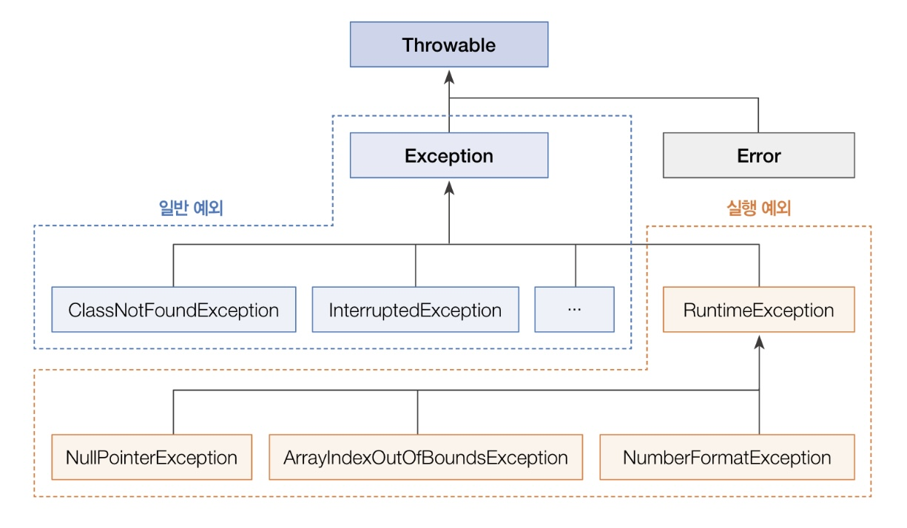
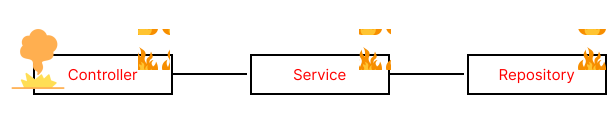

spring으로 개발하면서 자바 예외를 처리한 적은 있지만, 자바 예외처리에 대해 자세히 공부한 적이 없어 이번 기회에 정했다.

먼저 자바 예외에 대해 알아보고 어떻게 처리하는 지 알아보자!

자바 예외처리는 인프런의 ****[<span style="color:#3366BB">스프링 DB 1편 - 데이터 접근 핵심 원리</span>](https://www.inflearn.com/course/%EC%8A%A4%ED%94%84%EB%A7%81-db-1/dashboard)****와 책 [<span style="color:#3366BB">이것이 자바다.</span>](https://ebook-product.kyobobook.co.kr/dig/epd/ebook/E000002962808)를 참고했습니다.  
{: .notice--info}

# 자바의 예외 클래스

자바에서 어떻게 예외를 구분하는지 그림을 보면서 알아보자.

<p align = "center"></p>
위의 그림은 자바의 예외 클래스를 보여준다.

Throwable: 최상위 예외 클래스이다. Object 클래스를 상속받고, 하위에 Exception과 Error가 있다.

error: 메모리 부족이나 심각한 시스템 오류와 같이 애플리케이션에서 복구 불가능한 시스템 예외이다. 애플리케이션에서 이 error을 잡으면 안된다. 

만약 catch로 예외를 잡을 때 Error가 포함된 Throwable을 잡게 된다면 하위 클래스인 Error도 잡히기때문에 Throwable 또한 잡으면 안된다.

Exception: 애플리케이션에서 사용할 수 있는 실질적 최상위 예외이다. 컴파일러가 예외 처리 코드 여부를 검사해주는 예외로 runtimeException을 제외한 모든 예외를 **체크 예외**, **일반 예외라**고 부른다.

runtimeException: 컴파일러가 예외 처리 코드 여부를 확인하지 않는 예외로, runtimeException과 그 하위 예외를 **언체크 예외**, **런타임 예외**라고 부른다.

개발자가 컨트롤 할 수 있는 예외 클래스는 Exception과 RuntimeException이라고 생각하면 된다.

이 둘의 차이는 무엇일까?? 

체크 예외, 언체크 예외같은 이름처럼 컴파일러가 예외 코드를 검사하냐 안하냐의 차이이다.

예외 클래스에 대해서 알아보았다. 이제 예외를 어떻게 처리해야하는지 알아보자.

## 예외 처리 방식

**자바의 예외는 폭탄 돌리기와 같다.** 예외를 잡아서 처리하거나, 처리할 수 없으면 밖으로 던져야 한다.

Repository에서 에러가 났다고 가정해보자.

<p align = "center"></p>

예외가 발생한 Repository에서 예외를 처리하지 않고 넘기면 어떻게 될까?

<p align = "center"></p>

Repository에서 발생한 에러를 처리해주지 않고 넘겨 Service까지 왔다. 

만약 Service에서 에러를 인지하고 처리하면 Controller까지 에러가 번지지 않아 서비스를 유지하면서 계속 동작할 수 있다.

<p align = "center"></p>

Service에서도 예외를 처리하지 않고 넘기면 Controller로 에러가 넘어가고 Controller에서도 에러를 처리하지 않으면 Main문으로 넘어가 예외 로그를 출력하면서 프로그램이 종료된다. 

하나의 에러때문에 프로그램이 종료되는 일은 발생하면 안되기 때문에 예외 처리방법을 잘 알아두자!

# 예외 처리방법

예외 처리방법은 위에서 말했듯이 예외를 발생시 처리하는 방법과 뒤로 넘기는 방법 2가지가 있다. 

먼저 예외를 잡아 처리하는 방법을 알아보자.

예외가 발생했을 때 프로그램의 갑작스러운 종류를 막고 정상 실행을 유지할 수 있도록 처리하는 코드를 **예외 처리 코드**라고 한다.

## try-catch-finally

자바에서 예외 처리 코드는 try-catch-finally블록으로 구성된다. 

```java
try{
		예외 발생 가능 코드
} catch (예외클래스 e) {
		예외 처리
} finally {
		항상 실행되는 코드
}
```

try-catch-finally블록은 예외의 유무에 따라 두가지 방식으로 처리된다.

정상동작 코드:  try블록안에 있는 코드가 예외를 발생시키지 않고 정상동작하면 catch블록을 Pass한다.

예외가 발생한 코드: try블록안에 있는 코드가 예외를 발생시키면 catch문에서 해당 예외를 처리한다.(log출력, retry, 등등) 

이후 예외의 유무에 상관없이 finally블록은 실행된다.  finally블록은 옵션으로 생략이 가능하다.

### try-catch-finally예시 코드

매개변수에 null이면 예외를 발생시키고, 숫자면 숫자를 출력시키는 메서드를 만들었다.

```java
public void printLullPointException(Integer n) {
    try {
        if (n == null) {
            throw new NullPointerException();
        } else {
            System.out.println(n);
        }

    } catch (NullPointerException e) {
        System.out.println("error = " + e);
				System.out.println("catch블록");
    } finally {
        System.out.println("finally블록");
    }
}
```

숫자 1이 들어오면 1을 출력하고 

```java
1
finally블록
```

null이 들어오면 예외클래스를 출력한다.

```java
error = java.lang.NullPointerException
catch블록
finally블록
```

출력처럼 Finally블록은 어떤 상황이든지 실행되고 catch블록은 해당 예외 클래스가 발생했을 때만 실행된다.

## try-catch-resources

프로그램에서 리소스를 사용하기 위해서는 해당 리소스를 열어야 하며, 사용이 끝나면 닫아줘야 다른 프로그램에서 해당 리소스를 사용할 수 없다. 그렇기 때문에 리소스를 사용하다가 예외가 발생되는 경우에도 안전하게 닫는 것이 매우 중요하다.

이런 경우 무조건 사용되는 finally블록에서 리소스를 닫아준다. 

```java
FileInputStream fis = null;
try {
		fis = new FileInputStream("file.txt");
		...
} catch(IOException e) {
		...
} finally {
		fis.close();
}
```

리소스를 사용할 때마다 finally블록에서 리소스를 닫는 것은 코드가 반복되고, 개발자의 실수로 닫지 않으면 다른 프로그램에서 해당 리소스를 사용하지 못하는 에러가 발생된다. 매번 열었던 리소스를 닫기는 쉽지 않기 때문에 try-catch-resources 블록을 사용한다.

try-catch-resources 블록을 사용하면 밑의 코드처럼 finally에서 파일을 닫아주지 않아도 된다.

```java
try(FileInputStream fis = new FileInputStream("file.txt")) {
		...
} catch (IOException e) {
		...		
}
```

하지만 try-catch-resources 블록을 사용하기 위해서는 한 가지 조건이 붙는데 AutoCloseable 인터페이스를 구현해서 `close()` 메소드를 Override하여 재정의해야한다.

```java
public class FileInputStream implements AutoCloseable {
		...
		@Override
		public void close() throws Exception {
				...
		}
}
```

리소스를 처리해야하는 메서드에서 한번 `close()` 메서드를 구현하기만 하면 그 뒤에 객체를 사용하여 리소스를 열었을 때도 파일을 닫지 않아도 알아서 처리해준다.

리소스를 사용할 때는 try-catch-resources 블록을 사용해보자

## 예외 던지기

예외를 잡아서 처리하는 예외처리코드를 알아봤다. 그럼 예외 처리 2번째 방법인 예외 던지기에 대해 알아보자.

예외 던지기는 예외가 발생한 메서드에서 예외를 처리하지 않고, 해당 메서드를 호출한 곳으로 예외를 넘기는 것이다. 

밑의 그림처럼 repository에서 예외가 발생하면 repository의 메서드를 호출한 service로 예외를 넘길 수 있다.

<p align = "center"></p>

### throws

예외를 호출한 메서드에게 던지려면 `throws` 키워드를 사용하면 된다. 

try-catch-finally블록에서 사용한 메서드에서 예외 처리 코드를 제외한 코드이다.

```java
public void printLullPointException(Integer n) throws NullPointerException {
    if (n == null) {
        throw new NullPointerException();
    } else {
        System.out.println(n);
    }
}
```

예외 처리 코드를 제외하고 `throws NullPointerException` 를 추가하여 호출한 메서드에게 예외를 떠넘겼다. 그럼 이 메서드를 main문에서 실행하면 어떻게 될까?

```java
public static void main(String[] args) {
    printLullPointException(null);
}
//결과
Exception in thread "main" java.lang.NullPointerException
```

떠넘긴 `NullPointerException` 에러때문에 프로그램이 강제 종료되었다. 프로그램을 정상동작시키려면 메서드를 호출한 쪽에서 try-catch-finally블록으로 예외를 처리해야 한다.

```java
public static void main(String[] args) {
    try {
        printLullPointException(null);
    } catch (NullPointerException e) {
        System.out.println("e = " + e);
        System.out.println("null이 아닌 숫자를 입력해주세요.");
    }
}
//결과
e = java.lang.NullPointerException
null이 아닌 숫자를 입력해주세요.
```

지금까지 자바에서 예외 클래스와 예외 처리방법 2가지를 알아보았다. 자바를 처리하는 방법은 크게 이 2가지 방법이므로 예제를 통해서 한번 사용해보자.